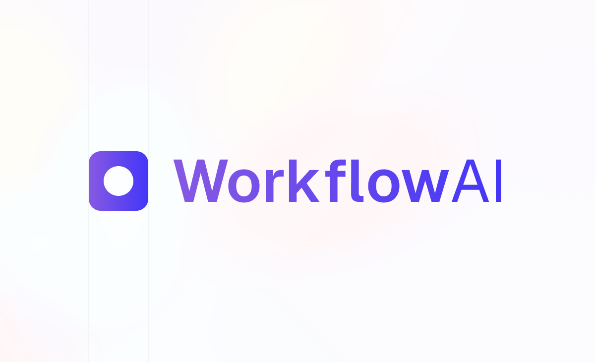
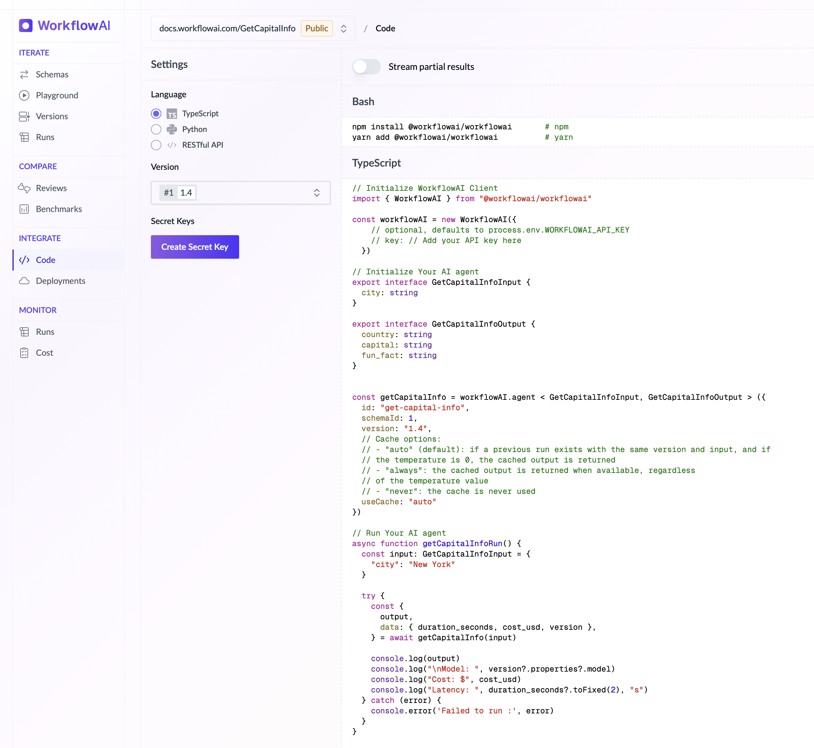

# Javascript / Typescript SDK for WorkflowAI

## WorkflowAI

[WorkflowAI](https://workflowai.com) is an open-source platform where product and engineering teams collaborate to build and iterate on AI features.

## Get Started

1. Go to [workflowai.com](https://workflowai.com).
2. Enter your company URL, and get suggestions of AI-powered features for your product.
3. Build your first AI features in a few minutes.
4. Then go to the **Code** section to copy the code generated for Typescript.

